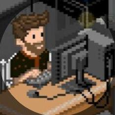
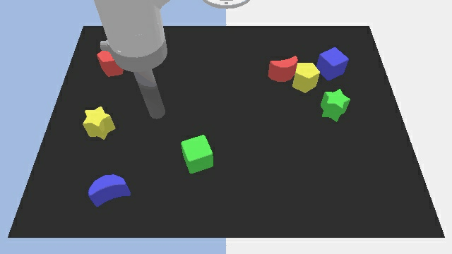

## About Me

Hi! I’m a Data Scientist based in Madrid, Spain. I specialize in Machine Learning, Deep Learning, NLP, Computer Vision, and Data Analysis. Currently, I’m working at EIPSA S.A., where I develop object detection models for metallurgy companies, automate data entry processes, generate tracking reports for received documentation, and implement deep learning solutions for identifying technical drawings. Feel free to contact me via <jparedescolmenarejo@gmail.com>.

## My Repositories

1. &nbsp;  <b>Paredes, J.</b> <em>"Fluorescent Penetrant Inspection Test, Detection of liquid penetrant test with AI"</em> (YOLO11) Development of object detection models tailored for metallurgy companies. (FPI, DP, LPI, PT)  
[[Model]](https://huggingface.co/jparedesDS/fluorescent-penetrant-inspection) [[Code]](https://github.com/jparedesDS/fluorescent-penetrant-inspection)

2. &nbsp;  <b>Paredes, J.</b> <em>"Data Extraction from DXF Files for entity identification in technical drawings"</em>
Implementation of deep learning algorithms for the recognition and classification of technical drawings, enabling automated documentation handling.  
[[Code]](https://github.com/jparedesDS/extract-data-dxf)

3. &nbsp;  <b>Paredes, J.</b> <em>"Email MAPI Tools Automation"</em> Automation of documentation entry through email (Outlook/IMAP) to excel and BBDD (ERP). 
[[Code]](https://github.com/jparedesDS/email-mapi-tools-automation)

4. &nbsp;  Serrano, E., <b>Paredes, J.</b> <em>"EIPSA ERP"</em> Based on an ERP (Enterprise Resource Planning) system to manage the different daily activities of the different sections of the company.  
[[Code]](https://github.com/jparedesDS/ERP_EIPSA)

5. &nbsp;  <b>Paredes, J.</b> <em>"Welding Defects Detector, detection of welding defects with AI"</em> (YOLO11)
Development of object detection models tailored for metallurgy companies.  
[[Model]](https://huggingface.co/jparedesDS/welding-defects-detection) [[Code]](https://github.com/jparedesDS/welding-defects-detection)

6. &nbsp;  <b>Paredes, J.</b> <em>"HLTV Team and Player Stats Scraper"</em> Scraping and data analysis of each individual and team player for the Counter Strike 2 competitive game.  
[[Code]](https://github.com/jparedesDS/hltv-scraper)

7. &nbsp;  <b>Paredes, J.</b> <em>"Twitter - Sentiment Analysis with Emojis"</em> using emojis to classify the emotional tone of tweets. By leveraging Natural Language Processing (NLP) techniques.  
[[Code]](https://github.com/jparedesDS/lazy-classifier-traffic-accidents-madrid)

8. &nbsp;  <b>Paredes, J.</b> <em>"Twitter Sentiment Analysis"</em> identifying positive and negative emotions while exploring various natural language characteristics.  
[[Code]](https://github.com/jparedesDS/tensorflow-twitter-sentiment-analysis)

9. &nbsp;  <b>Paredes, J.</b> <em>"Analysis of Traffic Accidents"</em> Analysis and predictions of Traffic Accidents in the City of Madrid  
[[Code]](https://github.com/jparedesDS/lazy-classifier-traffic-accidents-madrid)

10. &nbsp;  <b>Paredes, J.</b> <em>"Image & Vision Classification of Futurama Frames"</em> Identification characters in Futurama frames - Kaggle Competition 🥉3º position - ResNet152 & Keras/Tensorflow  
[[Code]](https://github.com/jparedesDS/image-classification-multilabel)

## MODELS Computer Vision // Object Detection

1. _Counter Strike 2 Players Detector_ - Players Identification of CS2 (YOLOv9, YOLOv10 & YOLO11) 2024 [under review] [[HuggingFace]](https://huggingface.co/collections/jparedesDS/cs2-yolo-object-detection-66f65a7fa395d5e5ede71489) [[GitHub]](https://github.com/jparedesDS/cs2-object-dectection)  
2. _Valorant Players Detector_ - Players Identification of Valorant (YOLOv10 & YOLO11) 2024 [under review] [[HuggingFace]](https://huggingface.co/collections/jparedesDS/valorant-yolo-object-detection-6708db8eda7c23b8859bcd3b) [[GitHub]](https://github.com/jparedesDS/valorant-object-detection)  
3. _Fortnite Players Detector_ - Players Identification of CS2 (YOLO11) 2024 [under review] [[HuggingFace]](https://huggingface.co/jparedesDS/fortnite-yolo11m) [[GitHub]](https://github.com/jparedesDS/fortnite-object-detection)  
4. _OverWatch 2 Players Detector_ - Players Identification of OW2 (YOLO11) 2024 [under review] [[HuggingFace]](https://huggingface.co/jparedesDS/ow2-yolo11m) [[GitHub]](https://github.com/jparedesDS/ow2-object-dectection)  
5. _Deadlock Players Detector_ - Players Identification of Deadlock (YOLO11) 2024 [under review] [[HuggingFace]](https://huggingface.co/jparedesDS/deadlock-yolo11l) [[GitHub]](https://github.com/jparedesDS/deadlock-object-detection)  

## Invited Talks

- _Scaling Robot Learning_ - CSIRO Data61  
- _Pretraining for Robot Learning_ - Australian Institue for Machine Learning (AIML) 
- _Grounding Large Language Models using 3D Scene Graphs for Scalable Robot Task Planning_ - QUT Centre for Robotics (Mid Year Retreat) 
- _Scaling Robot Learning_ - Technical University of Darmstadt  
- _Accelerating Reinforcement Learning_ - Center for Cognitive Interaction Technology, University of Bielefeld

## Patents

1. Method and System for Generating a Robot Task Plan  
   Patent Number au2023904229  
   K. Rana, N. Suenderhauf  

2. Ophthalmic Imaging Apparatus and System  
   Patent Number au2017901153  
   A. Jaiprakash, D. Palmer, D. G. Dansereau, T. Coppin, K. Rana, J. Roberts, R. Crawford  
   
3. Method and System for Calibrating an Ophthalmic Imager   
   Patent Number au2018900513   
   D. Palmer, T. Coppin, K. Rana
   
## Grants
- QCR Early Career Researcher Grant Award: _Learning an Instance and View-Point Invariant
Manipulation Skills Database for Service Robots_ 2022-2023
- UA-DAAD Australia-Germany Joint Research Cooperation Scheme
Project: _Sample-efficient learning for autonomous agents in complex hierarchical, and sparse environments_ 2020-2023

## Teaching

- Lecturer: IFN680 Artificial Intelligence and Machine Learning (Masters Specialisation Unit) _2023_
- Tutor: DXB211 Creative Coding _2020-2021_

