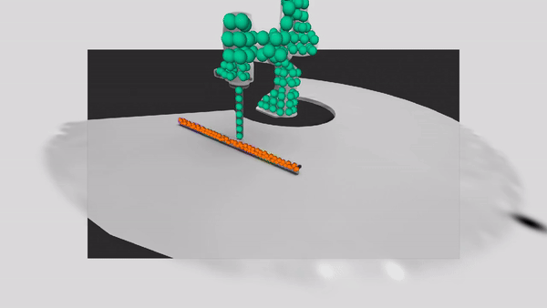
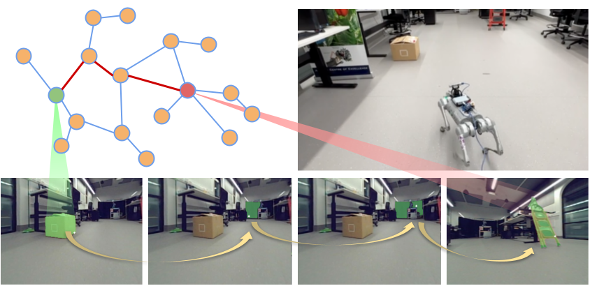

## About Me

Hi! I am a postdoctoral researcher at the QUT Centre for Robotics working on **robot learning** which lies at the intersection of AI and robotics with a focus on **teaching robots to intelligently plan and interact with the world** in order to solve everyday tasks. Feel free to contact me via <ranak@qut.edu.au>.

## Publications

1.  <b>Rana, K.</b>, Abou-Chakra, J., Garg, S., Lee, R., Reid, I., & Sünderhauf, N. <em>"Affordance-Centric Policy Decomposition :
Generalisable and Sample Efficient Robot Policy Learning for Multi-Object, Long-Horizon Manipulation"</em> [under review])   
[[Paper]](https://policy-decomposition.github.io/Images/paper.pdf) [[Site]](https://policy-decomposition.github.io/)

2.  Abou-Chakra, J., <b>Rana, K.</b>, Dayoub, F., & Sünderhauf, N. <em>"Physically Embodied Gaussian Splatting: A Realtime Correctable World Model for Robotics"</em> [under review]   
[[Paper]](https://arxiv.org/abs/2406.10788) [[Site]](https://embodied-gaussians.github.io/)

3.  Open X-Embodiment Collaboration <em>"Open X-Embodiment: Robotic Learning Datasets and RT-X Models"</em> 2024 International Conference on Robotics and Automation (ICRA) [under review]  
[[Paper]](https://robotics-transformer-x.github.io/paper.pdf) [[Site]](https://robotics-transformer-x.github.io/)

4.  Abou-Chakra, J., <b>Rana, K.</b>, Dayoub, F., & Sünderhauf, N. <em>"Physically Embodied Gaussian Splatting: Embedding Physical Priors into a Visual 3D World Model For Robotics"</em> 2023 Conference on Robot Learning (CoRL) Workshop for Neural Representation Learning for Robot Manipulation [under review]  
[[Site]](https://embodied-gaussians.github.io/)

5.  Garg, S., <b>Rana, K.</b>, Hosseinzadeh, M., Mares, L., Sünderhauf, N., Dayoub, F., & Reid, I. <em>"RoboHop: Segment-based Topological Map Representation for
Open-World Visual Navigation"</em> 2024 International Conference on Robotics and Automation (ICRA) [under review]  
[[Paper]](#) [[Site]](https://oravus.github.io/RoboHop/)

6.  <b>Rana, K.</b>, Melnik, A., & Sünderhauf, N. <em>"Contrastive Language, Action, and State
Pre-training for Robot Learning"</em> 2024 International Conference on Robotics and Automation (ICRA) Pretraining for Robotics Workshop  
[[Paper]](https://openreview.net/pdf?id=sxKR6zhBDH)

7.  <b>Rana, K.</b>, Milford, M., & Sünderhauf, N. <em>"Residual Skill Policies: Learning an Adaptable Skill Space for Reinforcement Learning for Robotics"</em> 2022 Conference on Robot Learning (CoRL) 
[[Paper]](https://arxiv.org/abs/2211.02231) [[Code]](https://github.com/krishanrana/reskill) [[Site]](https://krishanrana.github.io/reskill)

8.  <b>Rana, K.</b>, Dasagi, V., Haviland, J., Milford, M., & Sünderhauf, N. <em>"Zero-Shot Uncertainty-Aware Deployment of Simulation Trained Policies on Real-World Robots"</em> NeurIPS 2021 Workshop on Deployable Decision Making in Embodied Systems (DDM) | Spotlight  
[[Paper]](https://arxiv.org/abs/2112.05299) [[Code]](https://github.com/krishanrana/bcf) [[Site]](https://krishanrana.github.io/bcf)

9.  <b>Rana, K.</b>, Dasagi, V., Haviland, J., Milford, M., & Sünderhauf, N. <em>"Bayesian Controller Fusion: Leveraging Control Priors in Deep Reinforcement Learning for Robotics"</em> The International Journal of Robotics Research (IJRR)  
[[Paper]](https://journals.sagepub.com/doi/full/10.1177/02783649231167210) [[Code]](https://github.com/krishanrana/bcf) [[Site]](https://krishanrana.github.io/bcf)

10.  <b>Rana, K.</b>, Dasagi, V., Talbot, B., Milford, M., & Sunderhauf, N. (2020). <em>"Multiplicative Controller Fusion: Leveraging Algorithmic Priors for Sample-efficient Reinforcement Learning and Safe Sim-To-Real Transfer"</em>. 2020 International Conference on Intelligent Robots and Systems (IROS)  
[[Paper]](https://arxiv.org/abs/2003.05117) [[Code]](https://github.com/krishanrana/multiplicative_controller_fusion) [[Site]](https://sites.google.com/view/mcf-nav/home)

11. &nbsp;  <b>Rana, K.</b>, Talbot, B., Milford, M., & Sünderhauf, N. (2020). <em>"Residual Reactive Navigation: Combining Classical and Learned Navigation Strategies For Deployment in Unknown Environments"</em>. 2020 IEEE International Conference on Robotics and Automation (ICRA), 11493-11499.  
[[Paper]](https://arxiv.org/pdf/1909.10972.pdf) [[Code]](https://github.com/krishanrana/2D_SRRN) [[Site]](https://sites.google.com/view/srrn/home)

12. &nbsp;  Melnik, A., Harter, A., Limberg, C., <b>Rana, K.</b>, Sünderhauf, N., & Ritter, H. <em>"Critic Guided Segmentation of Rewarding Objects in First Person Views"</em>. German Conference of Artificial Intelligence, 2021.  
[[Paper]](https://arxiv.org/abs/2107.09540)

13. &nbsp; Palmer, D.W., Coppin, T., <b>Rana, K.</b>, Dansereau, D., Suheimat, M., Maynard, M., Atchison, D., Roberts, J., Crawford, R., & Jaiprakash, A. (2018). <em>"Glare-free retinal imaging using a portable light field fundus camera"</em>. Biomedical Optics Express, 9, 3178 - 3192.  
[[Paper]](https://www.osapublishing.org/viewmedia.cfm?seq=0&uri=boe-9-7-3178)

14. &nbsp;  Coppin, T., Palmer, D.W.,  <b>Rana, K.</b>, Dansereau, D., Collins, M., Atchison, D., Roberts, J., Crawford, R., & Jaiprakash, A. (2021). <em>"Design of a Focused Light Field Fundus Camera for Retinal Imaging"</em>. [Under review for IEEE Transactions on Medical Imaging (T-MI)]  

## Organised Workshops

1. _Pretraining For Robotics Workshop_ - International Conference on Robotics and Automation (ICRA) 2024 [under review] [[Site]](https://pretraining4robotics.github.io/)  
2. _Behaviour Priors in Reinforcement Learning for Robotics Workshop_ - International Conference on Robotics and Automation (ICRA) 2022 [[Site]](https://sites.google.com/view/rlbp-icra2022/home)  

## Invited Talks

- _Scaling Robot Learning_ - CSIRO Data61  
- _Pretraining for Robot Learning_ - Australian Institue for Machine Learning (AIML) 
- _Grounding Large Language Models using 3D Scene Graphs for Scalable Robot Task Planning_ - QUT Centre for Robotics (Mid Year Retreat) 
- _Scaling Robot Learning_ - Technical University of Darmstadt  
- _Accelerating Reinforcement Learning_ - Center for Cognitive Interaction Technology, University of Bielefeld

## Patents

1. Method and System for Generating a Robot Task Plan  
   Patent Number au2023904229  
   K. Rana, N. Suenderhauf  

2. Ophthalmic Imaging Apparatus and System  
   Patent Number au2017901153  
   A. Jaiprakash, D. Palmer, D. G. Dansereau, T. Coppin, K. Rana, J. Roberts, R. Crawford  
   
3. Method and System for Calibrating an Ophthalmic Imager   
   Patent Number au2018900513   
   D. Palmer, T. Coppin, K. Rana
   
## Grants
- QCR Early Career Researcher Grant Award: _Learning an Instance and View-Point Invariant
Manipulation Skills Database for Service Robots_ 2022-2023
- UA-DAAD Australia-Germany Joint Research Cooperation Scheme
Project: _Sample-efficient learning for autonomous agents in complex hierarchical, and sparse environments_ 2020-2023

## Teaching

- Lecturer: IFN680 Artificial Intelligence and Machine Learning (Masters Specialisation Unit) _2023_
- Tutor: DXB211 Creative Coding _2020-2021_

