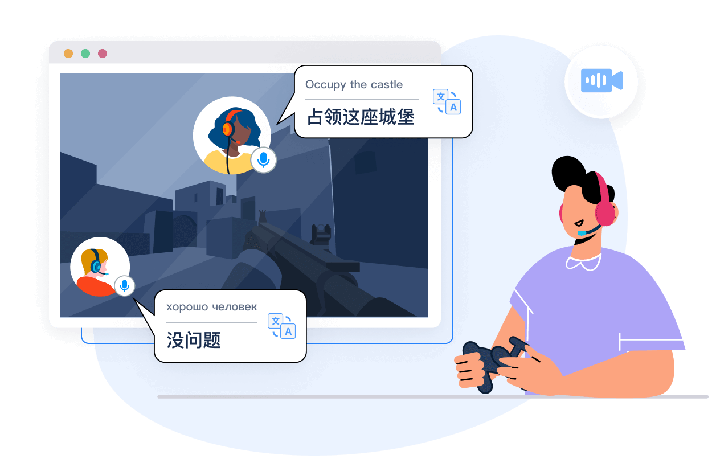
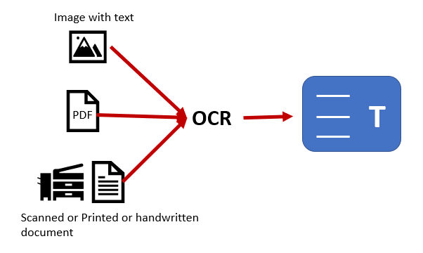
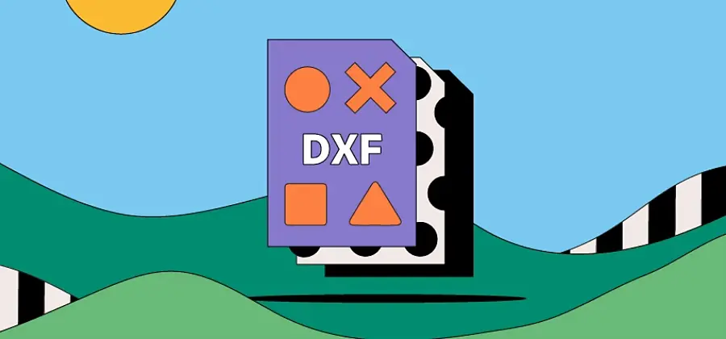
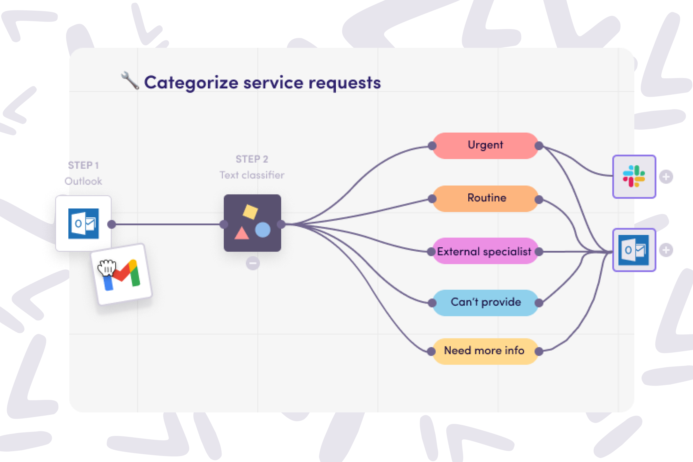
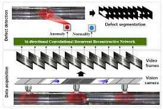
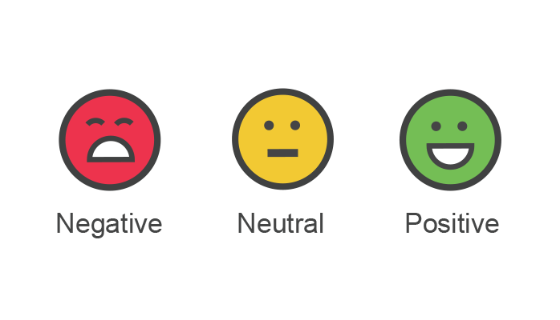
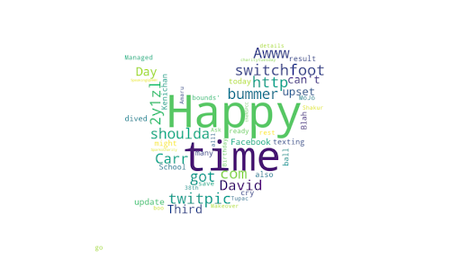
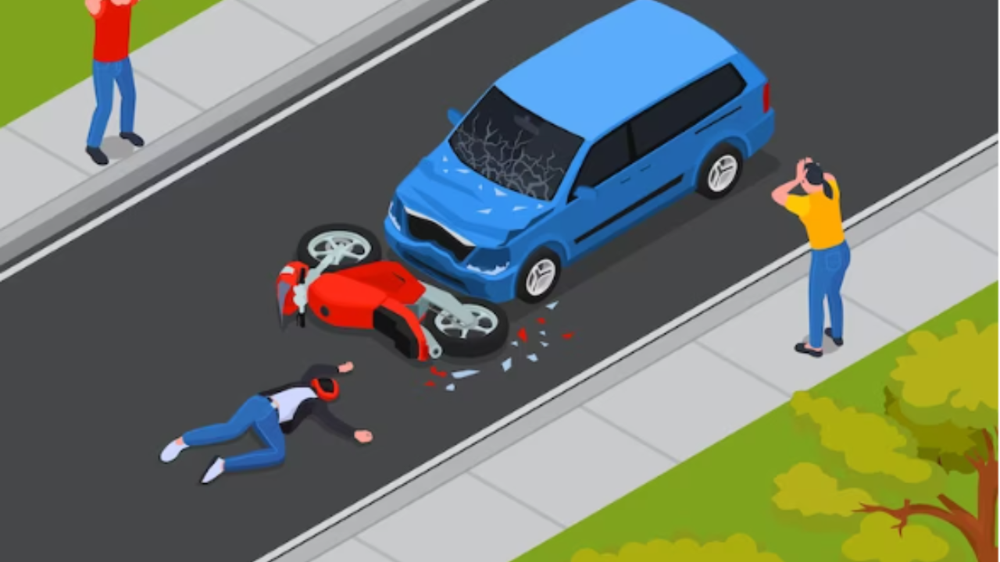
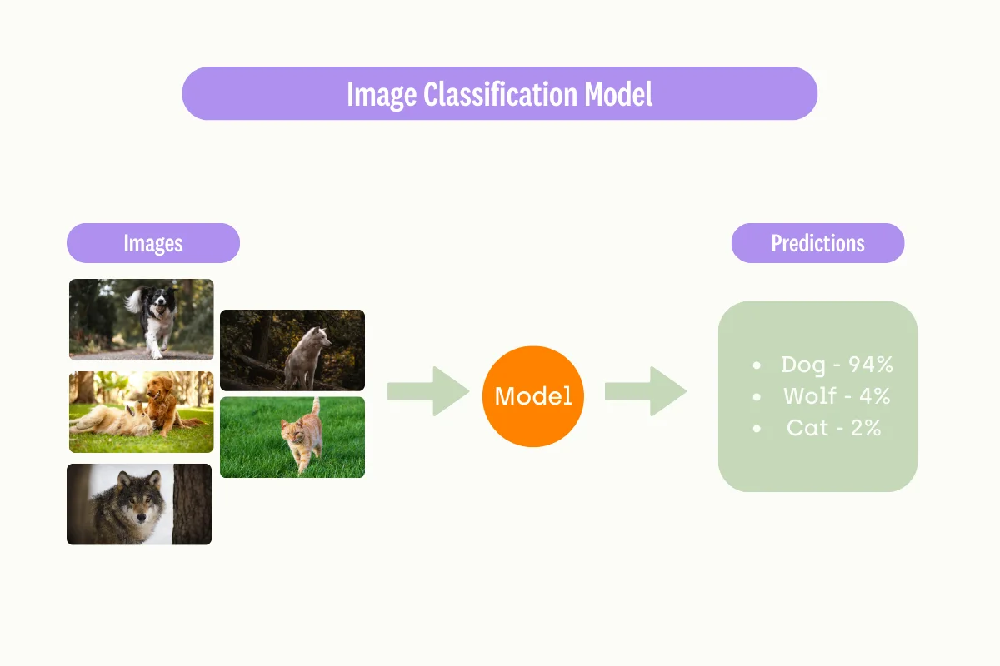

## About Me

Hi! I'm a Data Scientist based in Madrid, Spain. I specialize in Computer Vision, Deep Learning, NLP, and Data Analysis. Currently, I'm working at EIPSA S.A., where I develop object detection models for metallurgy companies, automate data entry processes, generate tracking reports for received documentation, and implement deep learning solutions for identifying technical drawings. Contact me via <jparedescolmenarejo@gmail.com>.

## My Portfolio
1. &nbsp;  <b>Paredes, J.</b> <em>"Claude Telegram Bot,</em> AI-powered Telegram bot integrating Claude API to provide conversational assistance, automation workflows, and command-based interactions directly from Telegram. Designed for real-time AI interaction and extensible automation scripts.  
[[code]](https://github.com/jparedesDS/claude-telegram)  

1. &nbsp;  <b>Paredes, J.</b> <em>"Polymarket Auto-Betting Bot,</em> Automated trading bot for BTC prediction markets (UP/DOWN 5m and 15m) on Polymarket. Uses limit maker orders at 45¢, Kelly criterion with Monte Carlo backtesting for position sizing, bail-out mechanism when only one leg fills, and gasless auto-redeem with on-chain fallback. Includes a Telegram bot for real-time dashboard, alerts, and controls.  
[[code]](https://github.com/jparedesDS/polymarket-autobetting) *(Private repo)*

1. &nbsp;  <b>Paredes, J.</b> <em>"TABLEAU, Documentation Flow Dashboard,</em> A visual progress report designed to monitor document inflow, processing, and delivery across projects.  
[[View on Tableau Public]](https://public.tableau.com/app/profile/jose.paredes6369/viz/INFORMEDEPROGRESO/DASHDOCUMENTACIN)  

1. &nbsp;  <b>Paredes, J.</b> <em>"DocuControl,</em> Automation of reports and document control, focused on the analysis of data exported from ERP and the generation of advanced visual reports.  
[[code]](https://github.com/jparedesDS/DocuControl) *(Private repo)*  

1. &nbsp;  <b>Paredes, J.</b> <em>"Twitch Automatic Subtitle Generation,</em> Captures system audio in real-time, transcribes it into text using a speech recognition model (ASR), and translates it from English to Spanish using HuggingFace models. STATUS: ALPHA DEVELOPMENT 
[[code]](https://github.com/jparedesDS/twitch-automatic-subtitle-generation)  

2. &nbsp;  <b>Paredes, J.</b> <em>"OCR Weapon Detection in Counter-Strike 2,</em> Captures the screen and detects weapon names in Counter-Strike 2 using Optical Character Recognition (OCR).  
[[code]](https://github.com/jparedesDS/OCR-Identification-CS2-Weapons)  

3. &nbsp;  <b>Paredes, J.</b> <em>"Fluorescent Penetrant Inspection Test, Detection of liquid penetrant test with AI"</em> (YOLO11) Development of object detection models tailored for metallurgy companies. (FPI, DP, LPI, PT)  
[[model]](https://huggingface.co/jparedesDS/fluorescent-penetrant-inspection) [[code]](https://github.com/jparedesDS/fluorescent-penetrant-inspection)

4. &nbsp;  <b>Paredes, J.</b> <em>"Data Extraction from DXF Files for entity identification in technical drawings"</em>
Implementation of deep learning algorithms for the recognition and classification of technical drawings, enabling automated documentation handling.  
[[code]](https://github.com/jparedesDS/extract-data-dxf)

5. &nbsp;  <b>Paredes, J.</b> <em>"Email MAPI Tools Automation"</em> Automation of documentation entry through email (Outlook/IMAP) to excel and BBDD (ERP). 
[[code]](https://github.com/jparedesDS/email-mapi-automation)

6. &nbsp;  Serrano, E., <b>Paredes, J.</b> <em>"EIPSA ERP"</em> Based on an ERP (Enterprise Resource Planning) system to manage the different daily activities of the different sections of the company.  
[[code]](https://github.com/jparedesDS/ERP_EIPSA)

7. &nbsp;  <b>Paredes, J.</b> <em>"Welding Defects Detector, detection of welding defects with AI"</em> (YOLO11)
Development of object detection models tailored for metallurgy companies.  
[[model]](https://huggingface.co/jparedesDS/welding-defects-detection) [[code]](https://github.com/jparedesDS/welding-defects-detection)

8. &nbsp;  <b>Paredes, J.</b> <em>"HLTV Team and Player Stats Scraper"</em> Scraping and data analysis of each individual and team player for the Counter Strike 2 competitive game.  
[[code]](https://github.com/jparedesDS/hltv-scraper)

9. &nbsp;  <b>Paredes, J.</b> <em>"Twitter - Sentiment Analysis with Emojis"</em> using emojis to classify the emotional tone of tweets. By leveraging Natural Language Processing (NLP) techniques.  
[[code]](https://github.com/jparedesDS/NLP-sentiment-analysis-with-emojis)

10. &nbsp;  <b>Paredes, J.</b> <em>"Twitter Sentiment Analysis"</em> identifying positive and negative emotions while exploring various natural language characteristics.  
[[code]](https://github.com/jparedesDS/tensorflow-twitter-sentiment-analysis)

11. &nbsp;  <b>Paredes, J.</b> <em>"Analysis of Traffic Accidents"</em> Analysis and predictions of Traffic Accidents in the City of Madrid  
[[code]](https://github.com/jparedesDS/lazy-classifier-traffic-accidents-madrid)

12. &nbsp;  <b>Paredes, J.</b> <em>"Image & Vision Classification of Futurama Frames"</em> Identification characters in Futurama frames - Kaggle Competition 🥉3º position - ResNet152 & Keras/Tensorflow  
[[kaggle]](https://www.kaggle.com/competitions/comp-mediavida-2-futurama/leaderboard) [[code]](https://github.com/jparedesDS/image-classification-multilabel)

13. &nbsp; <b>Paredes, J.</b> <em>"AI-YOLO Object Detection"</em> - AI-YOLO Project for Object Detection and Computer Vision.  
[[code]](https://github.com/jparedesDS/AI-YOLO)

14. &nbsp; <b>Paredes, J.</b> <em>"Data Wrangling Titanic"</em> - Complete cleaning and analysis of the Titanic dataset using pandas.  
[[code]](https://github.com/jparedesDS/data-wrangling-titanic)

15. &nbsp; <b>Paredes, J.</b> <em>"Monitoring Report Automation"</em> - Reduce report generation times and minimize manual data entry errors.  
[[code]](https://github.com/jparedesDS/monitoring-report)

16. &nbsp; <b>Paredes, J.</b> <em>"LoL Map Tracking Object Detection"</em> - League of Legends object detection and minimap tracking.  
[[code]](https://github.com/jparedesDS/lol-map-tracking-object-detection)

## <3 Computer Vision
1. _"Counter Strike 2 Weapon Detector"_ - Weapon Identification of CS2 (YOLO12m) _2025_   [[model]](https://huggingface.co/jparedesDS/cs2-yolo12m-weapon-detection) [[github]](https://github.com/jparedesDS/cs2-yolo12m-weapon-detection)  
1. _"Welding Defects Detector"_ - Detection of welding defects with AI (YOLO11x) _2024_   [[model]](https://huggingface.co/jparedesDS/welding-defects-detection) [[github]](https://github.com/jparedesDS/welding-defects-detection)  
2. _"Liquid Penetrant Test (DP, LPI, PT)"_ - Detection of liquid penetrant test with AI (YOLO11l) _2024_   [[model]](https://huggingface.co/jparedesDS/liquid-penetrant-test-detection) [[github]](https://github.com/jparedesDS/fluorescent-penetrant-inspection)  
3. _"Counter Strike 2 Players Detector"_ - Players Identification of CS2 (YOLO12s) _2025_   [[model]](https://huggingface.co/jparedesDS/cs2_yolo12s) [[github]](https://github.com/jparedesDS/cs2-object-dectection)  
4. _"Counter Strike 2 Players Detector"_ - Players Identification of CS2 (YOLOv9, YOLOv10 & YOLO11) _2024_   [[model]](https://huggingface.co/collections/jparedesDS/cs2-yolo-object-detection-66f65a7fa395d5e5ede71489) [[github]](https://github.com/jparedesDS/cs2-object-dectection)  
5. _"Valorant Players Detector"_ - Players Identification of Valorant (YOLOv10 & YOLO11) _2024_   [[model]](https://huggingface.co/collections/jparedesDS/valorant-yolo-object-detection-6708db8eda7c23b8859bcd3b) [[github]](https://github.com/jparedesDS/valorant-object-detection)  
6. _"Fortnite Players Detector"_ - Players Identification of CS2 (YOLO11) _2024_   [[model]](https://huggingface.co/jparedesDS/fortnite-yolo11m) [[github]](https://github.com/jparedesDS/fortnite-object-detection)  
7. _"OverWatch 2 Players Detector"_ - Players Identification of OW2 (YOLO11) _2024_   [[model]](https://huggingface.co/jparedesDS/ow2-yolo11m) [[github]](https://github.com/jparedesDS/ow2-object-dectection)  
8. _"Deadlock Players Detector"_ - Players Identification of Deadlock (YOLO11) _2024_   [[model]](https://huggingface.co/jparedesDS/deadlock-yolo11l) [[github]](https://github.com/jparedesDS/deadlock-object-detection)  
10. _"League of Legends Map Tracking"_ - Identification of all characters via the minimap (YOLO11) _2024_   [[github]](https://github.com/jparedesDS/lol-map-tracking-object-detection)  

## Contact with me

- _[[curriculum vitae]](https://jparedesds.github.io/resume.pdf)_  
- _[[linkedin]](https://www.linkedin.com/in/jparedesDS/)_  
- _[[github]](https://github.com/jparedesDS/)_  
- _[[huggingface]](https://huggingface.co/jparedesDS/)_  
- _[[kaggle]](https://www.kaggle.com/joseparedesc)_  
- _[[Twitter/X]](https://twitter.com/xhitoCS)_  

## ❤️ Why buy me a coffee?
If any of my repositories have been useful to you, saved you time, or inspired you in any way, you can support my work by buying me a coffee ☕
Your support helps me to:

Keep projects maintained and improved

Create new open source repositories

Spend more time documenting and explaining the code

👉 Buy me a coffee here:

Thank you for stopping by and supporting open source! 🚀
